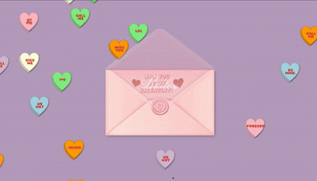

# Valentine’s Day Envelope App

A playful, **personal project** that offers an interactive Valentine’s Day experience. From a cute envelope animation to unexpected “yes” and “no” paths, this app is all about adding some fun (and a bit of sass) to this romantic holiday.

## Overview

- **Envelope Interaction**
  When you interact with the envelope, it reveals multiple paths based on your responses:

  - **Click “Yes”** to unlock confident, “I knew it!” reactions.
  - **Persist with “No”** until you eventually reach a hidden form or a final comedic “No” screen.

- **Form Validation**
  A short form pops up if you insist on saying “No.” The app demonstrates basic form validation by checking all required fields before you can proceed.

- **Sweetheart Candy Background**
  Animated candy hearts float around (and bump into each other), setting a whimsical tone.

Though built for a **single** special occasion, it’s a fun representation of creativity, humor, and a dash of code.

## Demonstrations

Below are three short GIFs showcasing the main flows of the app:

1. **Envelope Click → No Form Attempt → Validation Popup → Quick Switch to Yes**

   

2. **Envelope Click → A Few No’s → Then Choose Yes**
   

3. **Already on the Form Screen → Missing Last Name → Validation Error → Completion → Final No Screen**
   

These demos give a quick glimpse of how the choices lead to different screens and outcomes.

## Current Features

- **Interactive Envelope**
  Smooth transitions from a closed to open envelope, revealing the letter (plus some comedic dialogue when you hover or click).

- **Yes & No Paths**

  - **Yes Path**: A confident, celebratory screen with a cocky message.
  - **No Path**: Comically stubborn responses, culminating in a form or the ultimate “No” screen.

- **Form Handling**
  Basic validation ensures required fields are completed before allowing the user to proceed.

## Future Improvements

Although this project was developed **just in time for Valentine’s Day**, there are plans to expand it into a customizable, publicly accessible app in the future. Some planned enhancements include:

- **Customizable Messages & Colors**
  Let users add their own text, choose candy colors, or even upload their own background or GIFs.
- **Refined UI & Animations**
  Smoother transitions, more nuanced physics for the candy hearts, and improved mobile responsiveness.
- **Easier Public Sharing**
  Possibly add a shareable link or embed feature so users can send a personalized version to friends or loved ones.
- **Accessibility Updates**
  Expand focus states, ARIA labels, and keyboard navigation for a fully inclusive experience.

> **Note:** Because this project is releasing so close to Valentine’s Day, major updates and customizations will likely be revisited next year to keep it fresh and relevant for 2026’s holiday.

---

**Happy Valentine’s Day!** If you find a bug or just want to suggest a fun feature, feel free to open an issue or reach out. This app is primarily a personal passion project—and hopefully a source of some smiles. Enjoy exploring the envelope’s secrets!
